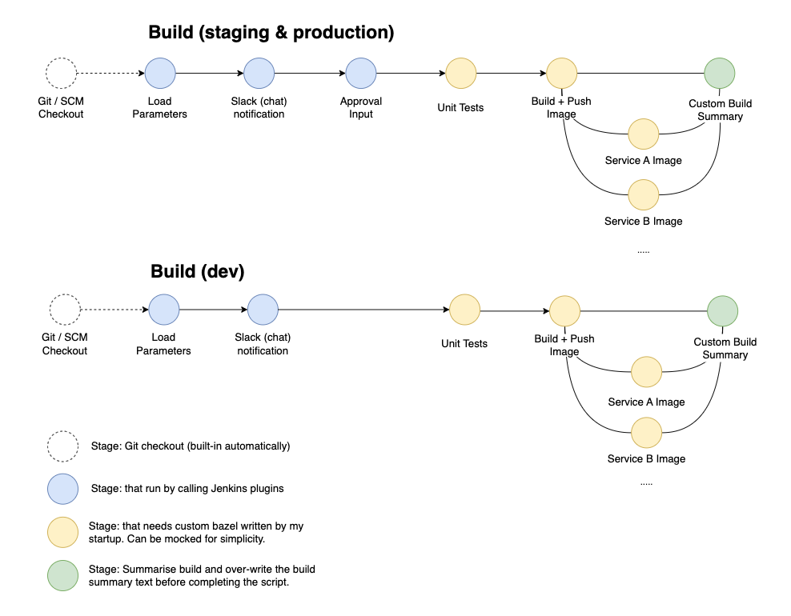
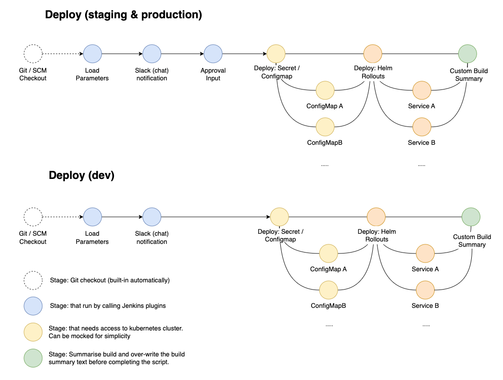

# Hello Jenkins project


## Defining Shared Libraries
A Shared Library is defined with a name, a source code retrieval method such as by SCM, and optionally a default version. The name should be a short identifier as it will be used in scripts.

The version could be anything understood by that SCM; for example, branches, tags, and commit hashes all work for Git. You may also declare whether scripts need to explicitly request that library (detailed below), or if it is present by default. Furthermore, if you specify a version in Jenkins configuration, you can block scripts from selecting a different version.

The best way to specify the SCM is using an SCM plugin which has been specifically updated to support a new API for checking out an arbitrary named version (Modern SCM option). As of this writing, the latest versions of the Git and Subversion plugins support this mode; others should follow.

If your SCM plugin has not been integrated, you may select Legacy SCM and pick anything offered. In this case, you need to include ${library.yourLibName.version} somewhere in the configuration of the SCM, so that during checkout the plugin will expand this variable to select the desired version. For example, for Subversion, you can set the Repository URL to svnserver/project/${library.yourLibName.version} and then use versions such as trunk or branches/dev or tags/1.0.

Directory structure
The directory structure of a Shared Library repository is as follows:

```
(root)
+- src                     # Groovy source files
|   +- org
|       +- daniel
|           +- ApprovalInput.groovy  # for org.daniel.ApprovalInput class
+- vars
|   +- foo.groovy          # for global 'foo' variable
|   +- foo.txt             # help for 'foo' variable
+- resources               # resource files (external libraries only)
|   +- org
|       +- foo
|           +- bar.json    # static helper data for org.foo.Bar
```
The `src` directory should look like standard Java source directory structure. This directory is added to the classpath when executing Pipelines.

The `vars` directory hosts script files that are exposed as a variable in Pipelines. The name of the file is the name of the variable in the Pipeline. So if you had a file called `vars/log.groovy` with a function like `def info(message)`…​ in it, you can access this function like `log.info "hello world"` in the Pipeline. You can put as many functions as you like inside this file. Read on below for more examples and options.

The basename of each `.groovy` file should be a Groovy (~ Java) identifier, conventionally `camelCased`. The matching `.txt`, if present, can contain documentation, processed through the system’s configured markup formatter (so may really be HTML, Markdown, etc., though the .txt extension is required). This documentation will only be visible on the Global Variable Reference pages that are accessed from the navigation sidebar of Pipeline jobs that import the shared library. In addition, those jobs must run successfully once before the shared library documentation will be generated.

The Groovy source files in these directories get the same “CPS transformation” as in Scripted Pipeline.

A resources directory allows the `libraryResource` step to be used from an external library to load associated non-Groovy files. Currently this feature is not supported for internal libraries.

Other directories under the root are reserved for future enhancements.

## Pipeline Diagram

As spoken, there are two pipelines: `Build` and `Deploy` pipeline. The following section describes the desired pipelines using diagram.

### Implementation

- `Build` pipeline: This pipeline is currently implemented in `old_pipeline/Build.Jenkinsfile`. When we create a multi-branch project in Jenkins, make sure to point the Jenkinfiles to path: `pipeline/Build.Jenkinsfile`.
- `Deploy` pipeline: This pipeline is currently implemented in `Deploy.Jenkinsfile`. When we create a multi-branch project in Jenkins, make sure to point the Jenkinfiles to path: `pipeline/Deploy.Jenkinsfile`.

### _Why refactoring_?

Both this pipelines require refactoring because everything is implemented in a single file and it feels like we can use groovy modules to refactor common functionalities of these two pipelines. We also want to share the common steps with other Jenkins pipeline that different teams in our company may utilise.

### `Build` pipeline

This pipeline is currently implemented in `old_pipeline/Build.Jenkinsfile`. It builds multiple services from a mono-repo multi-services (our developer wants to use monorepo style). Often, this pipeline is called fanout style where one pipeline has multiple builds / outputs.

Currently, we only have `Build.Jenkinsfile` for all environments but ideally, this is what the pipeline should looks like:

<br>

<p>
    
    <em>Figure 1. Build (CI) pipeline for dev, staging and production environment </em>
</p>

### `Deploy` pipeline

This pipeline is currently implemented in `old_pipeline/Deploy.Jenkinsfile`. It deploy multiple services from a mono-repo multi-services (our developer wants to use monorepo style). Often, this pipeline is called fanout style where one pipeline has multiple deployments / outputs.

### Common Stages

There are several common stages between `Build` and `Deploy` pipeline.
This stage is color coded in blue circle in the above diagram.

- Load parameters: We put parameters that will prompt user input before the pipeline runs. See this [screenshots](). TODO: might should we move this to property instead of using stage?
- Slack notification: When a pipeline starts, we notify a slack channel that someone is starting this job.
- Approval input: We asks authorized personels (hardcoded by username) to approve the pipeline runs. If it timeouts or get rejected. The pipeline execution is dropped. We only use this in `dev` environment.

### Internal Stages

There are several internal stages in `Build` and `Deploy` pipeline.
This stage is color coded in yellow or orange circle in the above diagram.

> :bulb: 💡
>
> Don't worry about these steps. You may mock it with a simple echo script, for example:
> ```bash
> stage("Unit Tests") {
>   steps { sh "echo running tests ..." }
> }
> ```

<br>

<p>
    
    <em>Figure 2. Deploy (CD) pipeline for dev, staging and production environment</em>
</p>

### Custom-build-summary Stage

Often, Jenkins build summary need to be enriched with what services we build and what are the parameters we took. Currently, it only display very limited information (see [screenshots](docs/pipeline.summary.png))

For example, we want to display:
1. What services the Jenkins user choses to build in this job.
2. What are other parameters the Jenkins user passes in the parameters stage.

I believe this specific needs can be catered directly using the following:

1. Using Jenkins plugin called [HTML Publisher](https://plugins.jenkins.io/htmlpublisher/). I haven't explored much but this is possibility?
2. Alterntively, we overwrite the current build display directly in the final stage.
    ```bash
    stage("Custom Build Summary") {
        script{
            currentBuild.description = "YOUR_BUILD_DESCRIPTION"
        }
    }
    ```

<br>
